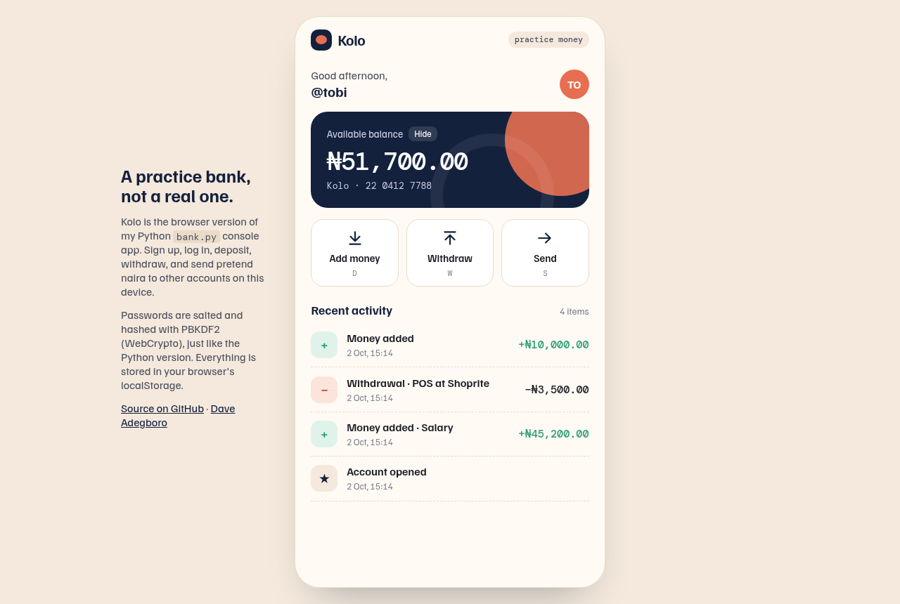
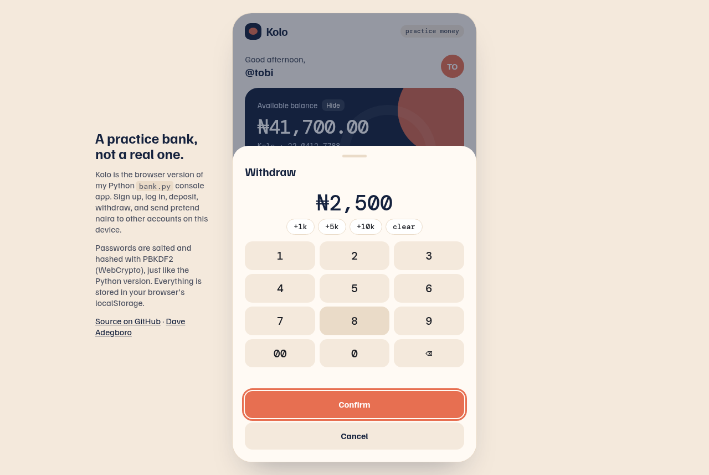
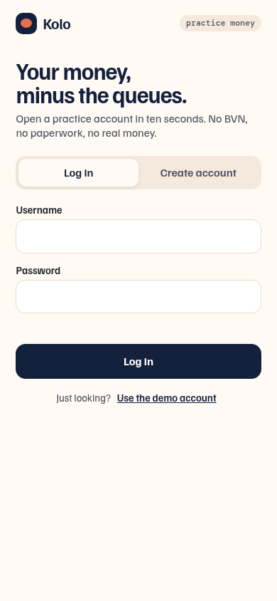

# Bank: a console bank in Python (plus *Kolo*, its browser twin)

This started as one of my first Python scripts: ask for a username and password, confirm it, and "log in". The first version had bugs. The retry never actually ran, and passwords were compared in plain text. So I rebuilt it as a proper little console bank that I'm happy to show.

You can open an account, log in, deposit, withdraw, transfer to another user, and see your history. Balances are kept in kobo (integers) so there's no floating-point rounding, and passwords are salted and hashed with PBKDF2. It's practice money only.

There's also **Kolo**, a browser version with the same rules, built like a small mobile banking app.

**Try Kolo in your browser:** https://dave-4u.github.io/bank/ (tap *Use the demo account*)

| Dashboard | Withdraw with the keypad | Sign in (phone) |
|---|---|---|
|  |  |  |

## Quickstart

```bash
./run.sh          # console bank (Python 3.8+, standard library only)
./run.sh test     # unit tests
./run.sh web      # serve Kolo at http://localhost:8000
```

On Windows: `python bank.py` and `python -m unittest discover -s tests -t .`

```
CONSOLE BANK  (practice project, not real money)

[1] Log in  [2] Create account  [3] Quit
> 1
Username: ada
Password:

Balance: ₦3,800.00
[1] Deposit  [2] Withdraw  [3] Transfer  [4] History  [5] Log out
```

## Features

- Sign up with username rules, password length, and confirmation. If the passwords don't match, it tells you nicely and lets you try again.
- Login uses the same error message for an unknown user or a wrong password, so it doesn't leak which usernames exist
- Deposit, withdraw (with an "insufficient funds" check), transfer between users, and the last 10 transactions
- Data is saved to `bank_data.json` (git-ignored) with an atomic write
- `bank_core.py` has no `input()`/`print()` and is covered by `tests/`
- **Kolo (web):** PBKDF2 via WebCrypto, a hide-balance toggle, a bottom-sheet keypad with quick `+1k / +5k / +10k` chips, transfers between accounts on the same device, an activity feed, and keyboard shortcuts (`D` deposit, `W` withdraw, `S` send, number keys on the keypad, `Esc` to close)

## Tech stack

Python 3 standard library (`hashlib`, `hmac`, `decimal`, `json`) and `unittest`. Kolo is a single HTML file using vanilla JS and the WebCrypto API.

## Roadmap

- Savings goals ("kolo" targets) with progress
- Monthly statements as CSV
- A small Flask API so the console and web versions share one database

## License

MIT © Adegboro David Oluwadamilare
